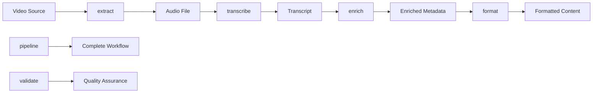

# CLI Commands Reference & Roadmap

This document outlines the current and planned CLI commands for the Content Pipeline project, targeting production release v1.0.0.

## 📊 Command Status Overview

| Status | Count | Description |
|--------|-------|-------------|
| ✅ **Implemented** | 2 | `extract` (v0.1.0-v0.4.0), `transcribe` (v0.5.0-v0.6.5) - Both refactored in v0.6.0 |
| 📋 **Planned for v1.0.0** | 6 | Essential commands for production release |
| 💭 **Future** | 2 | Conceptual, post-v1.0.0 |

---

## ✅ **Implemented Commands**

**Note:** v0.6.0 focused on CLI refactoring - transforming monolithic CLI into modular architecture. No new functionality was added to existing commands, only structural improvements for maintainability and extensibility.

### `extract`
**Status:** ✅ Implemented (v0.1.0 - v0.4.0), Refactored in v0.6.0  
**Purpose:** Extracts audio and metadata from YouTube URLs, local video files, and streaming platforms.

**Usage:**
```bash
content-pipeline extract --source VIDEO_SOURCE --output AUDIO_FILE [OPTIONS]
```

**Key Options:**
- `--source, -s`: Input video source (YouTube URL, local file, etc.)
- `--output, -o`: Output audio file path
- `--format`: Audio format (mp3, wav, etc.)
- `--quality`: Audio quality settings

**Example:**
```bash
content-pipeline extract --source "https://youtube.com/watch?v=abc123" --output ./audio.mp3
content-pipeline extract --source ./video.mp4 --output ./audio.wav --format wav
```

### `transcribe`
**Status:** ✅ Implemented in v0.5.0, Refactored in v0.6.0, Enhanced in v0.6.5  
**Purpose:** Converts audio files to text transcripts using multiple transcription engines with configuration management.

**Usage:**
```bash
content-pipeline transcribe --source AUDIO_FILE --engine ENGINE_TYPE [OPTIONS]
```

**Key Options:**
- `--source, -s`: Input audio file path
- `--output, -o`: Output transcript file path
- `--engine`: **REQUIRED** - Transcription engine (local-whisper, openai-whisper, aws-transcribe, auto)
- `--language, -l`: Source language (auto-detect if not specified)
- `--model`: Model size/version for selected engine
- `--api-key`: API key for cloud services
- `--config`: Path to YAML configuration file
- `--output-dir`: Output directory (overrides configuration)
- `--log-level`: Logging verbosity (debug, info, warning, error)

**Examples:**

**v0.5.0-v0.6.0 (Legacy):**
```bash
content-pipeline transcribe --source ./audio.mp3 --output ./transcript.json --language en
```

**v0.6.5 Examples:**
```bash
# Local Whisper (privacy-first)
content-pipeline transcribe --source audio.mp3 --engine local-whisper --model base

# OpenAI API (quality-first)
content-pipeline transcribe --source audio.mp3 --engine openai-whisper --api-key $OPENAI_API_KEY

# AWS Transcribe (enterprise)
content-pipeline transcribe --source audio.mp3 --engine aws-transcribe

# Auto engine selection
content-pipeline transcribe --source audio.mp3 --engine auto --config ~/.content-pipeline/config.yaml

# Custom output directory
content-pipeline transcribe --source audio.mp3 --engine local-whisper --output-dir ./my-transcripts
```

**Enhanced in v0.6.5:**
- ✅ Multiple engine support (local-whisper, openai-whisper, aws-transcribe, auto)
- ✅ Explicit engine selection via `--engine` flag (REQUIRED)
- ✅ YAML configuration file support
- ✅ Environment variable integration for API keys
- ✅ User-controlled output paths
- ✅ Breaking change: `--engine` flag is now required

---

## 📋 **Planned for v0.7.0+**

### `enrich`
**Status:** 📋 Planned for v0.7.0  
**Purpose:** Generates semantic metadata including summaries, tags, chapters, and key highlights using LLM processing.

**Planned Usage:**
```bash
content-pipeline enrich --source TRANSCRIPT_FILE --output ENRICHED_FILE [OPTIONS]
```

### `format`
**Status:** 📋 Planned for v0.8.0  
**Purpose:** Formats enriched content into various output formats (blog posts, social media threads, documentation).

### `validate`
**Status:** 📋 Planned for v0.9.0  
**Purpose:** Validates pipeline artifacts against schemas and performs quality checks.

### `publish`
**Status:** 📋 Planned for v0.10.0  
**Purpose:** Pushes formatted content to external platforms or publishing queues.

### `review`
**Status:** 📋 Planned for v0.11.0  
**Purpose:** Launches GUI or CLI interface to inspect and edit enriched metadata.

### `pipeline`
**Status:** 📋 Planned for v0.12.0  
**Purpose:** Runs complete end-to-end pipeline with a single command.

---

## 💭 **Future Commands** (Post-v1.0.0)

### `archive`
**Purpose:** Archives and indexes pipeline artifacts in cloud storage with search capabilities.

**Future Usage:**
```bash
content-pipeline archive --source CONTENT_DIR --storage STORAGE_TYPE [OPTIONS]
```

### `monitor`
**Purpose:** Real-time monitoring and logging of pipeline operations.

**Future Usage:**
```bash
content-pipeline monitor --agent AGENT_TYPE --stream STREAM_TYPE [OPTIONS]
```

---

## 🔄 **Command Workflow**

The commands are designed to work together in a typical content pipeline workflow:



**Typical Usage Flow:**
1. `extract` - Get audio from video source
2. `transcribe` - Convert audio to text
3. `enrich` - Add semantic metadata and insights
4. `format` - Create publishable content
5. `validate` - Ensure quality and correctness
6. `review` - Interactive content review and editing
7. `publish` - Deploy to external platforms

**Or use the unified command:**
- `pipeline` - Run complete workflow in one command

---

## 🎯 **v1.0.0 Production Goals**

For the v1.0.0 production release, we aim to have:

- ✅ **Core Commands:** `extract` (v0.1.0-v0.4.0), `transcribe` (v0.5.0)
- 🔧 **CLI Architecture:** Modular, extensible CLI framework (v0.6.0)
- 🎯 **Essential Commands:** `enrich`, `format`, `validate`, `publish`, `review`, `pipeline`
- 📚 **Complete Documentation:** Usage guides, examples, troubleshooting
- 🧪 **Comprehensive Testing:** Unit, integration, and property-based tests
- 🔧 **Production Ready:** Error handling, logging, configuration management

### **Complete v1.0.0 Command Set:**
1. **`extract`** - Audio extraction from video sources
2. **`transcribe`** - Speech-to-text conversion
3. **`enrich`** - LLM-based content enhancement
4. **`format`** - Multi-platform content formatting
5. **`validate`** - Quality assurance and schema validation
6. **`publish`** - External platform publishing
7. **`review`** - Interactive content review and editing
8. **`pipeline`** - End-to-end workflow automation

### **Version History Summary:**
- **v0.1.0 - v0.4.0:** `extract` command development and refinement
- **v0.5.0:** `transcribe` command implementation (local Whisper only)
- **v0.6.0:** CLI refactoring - modular architecture, no new functionality
- **v0.6.5:** Enhanced transcription with multiple engines (local-whisper, openai-whisper, aws-transcribe, auto), configuration management, and flexible output paths
- **v0.7.0:** `enrich` command implementation (planned)
- **v0.8.0:** `format` command implementation (planned)
- **v0.9.0:** `validate` command implementation (planned)
- **v0.10.0:** `publish` command implementation (planned)
- **v0.11.0:** `review` command implementation (planned)
- **v0.12.0:** `pipeline` command implementation (planned)
- **v1.0.0:** Production release with all 8 commands

---

## 📖 **Related Documentation**

- [Installation Guide](installation-guide.md) - Dependency setup and validation
- [Architecture Documentation](architecture.md) - System design and patterns

---

# 🛠️ Development Guide

This section provides basic guidance for understanding and extending the CLI architecture established in v0.6.0.

## 🏗️ CLI Architecture

For detailed CLI architecture information, see the [Architecture Documentation](architecture.md#cli-orchestration).

The modular CLI structure introduced in v0.6.0 enables easy extension for future commands.

## 🔧 Key Architecture Features

- **Modular Design**: Each command is a separate module
- **Shared Components**: Reusable decorators and help text
- **Dual Entry Points**: `python -m cli` and `content-pipeline` console script
- **Extensible**: Easy to add new commands in future versions

## 📝 Current Implementation (v0.6.5)

The current CLI provides:
- **extract**: Audio extraction from video sources
- **transcribe**: Speech-to-text conversion with multiple engines (local-whisper, openai-whisper, aws-transcribe, auto)
- **Configuration management**: YAML files and environment variables
- **Shared options**: Common decorators for input/output
- **Centralized help**: Consistent help text across commands

## 🚀 Future Roadmap

For detailed information about upcoming CLI commands and development roadmap, see the [Complete Documentation](README.md#upcoming).

For detailed development instructions, see the project's contribution guidelines.
